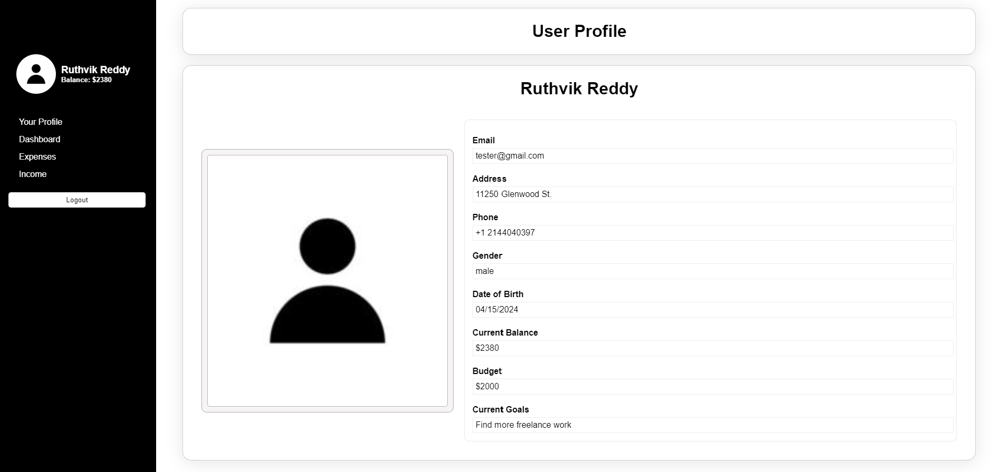

# expense-tracker

## Overview
This project aims to deliver a comprehensive expense tracking website where users can efficiently manage their spending. The website provides tools for tracking expenses by categories, analyzing spending habits, setting budgets, and generating insightful reports.

## Features
1. Expense and Income Tracking by Categories: Users can track expenses based on categories such as subscriptions, rent, healthcare, and more.
2. Time-Based Tracking: Users can monitor money spent per month, year, etc., gaining insights into their spending patterns over time.
3. Dashboard Visualization: The dashboard presents line charts and pie charts to visually represent spending habits, enabling users to analyze where they are spending how much.
4. Notes Attachment: Users can attach description to their expense or income providing context and aiding in transaction management.
5. Debit and Credit Analysis: The system tracks and analyzes debit and credit sources, helping users understand their expenditure limits.
6. Monthly Reports: Users can download reports over a timeline in excel format directly from the website.
8. Notifications: Email notifications alert users when their balance goes below zero.
9. Transaction Documentation: Users can log and track all expenses and income, upload expesnse receipts(e.g., grocery bills, medical bills) uploaded as images for future reference.

## Technologies Used
Front-end: Vue.js
Charting Library: Chart.js
State Management: Vuex
Routing: Vue Router





## Project setup
```
npm install
change backend url in global state
```

### Compiles and hot-reloads for development
```
npm run serve
```

### Compiles and minifies for production
```
npm run build
```

### Lints and fixes files
```
npm run lint
```

### Customize configuration
See [Configuration Reference](https://cli.vuejs.org/config/).
